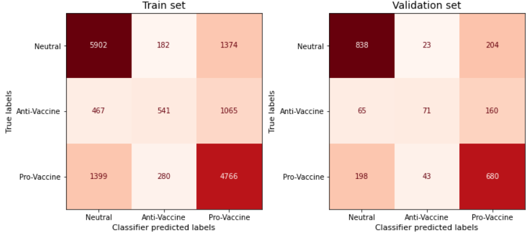
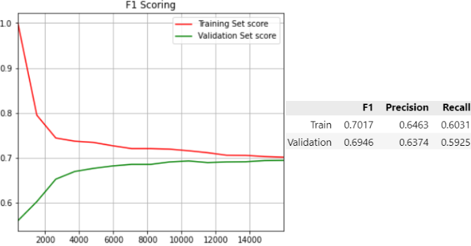
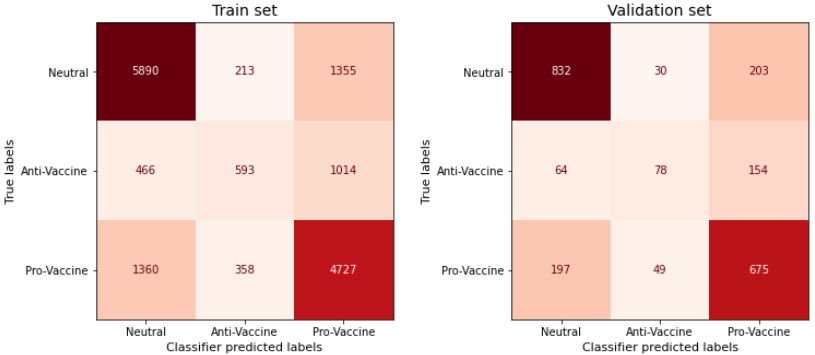
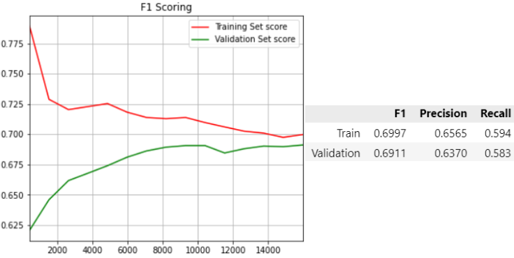
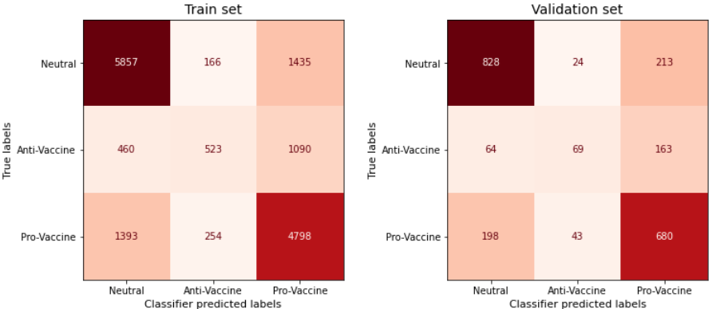
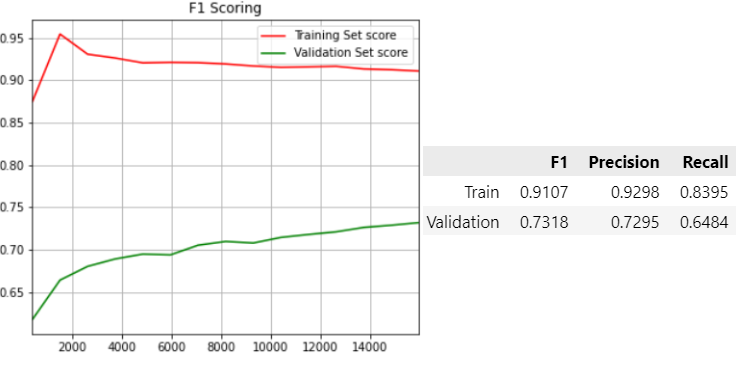

## TFIDF Vectorizer

- `min_df`, `max_df`, `ngram_range`

    
    

- `min_df`, `max_df`, `ngram_range` & `penalty="none"`

    
    

- `min_df`, `max_df`, preprocessing, stop words

    
    

- `min_df`, `max_df`

    
    

- `min_df`, `max_df`, preprocessing, stop words, `ngram_range`

    
    

- preprocessing, stop words, `ngram_range`

    
    

- preprocessing, stop words

    
    
