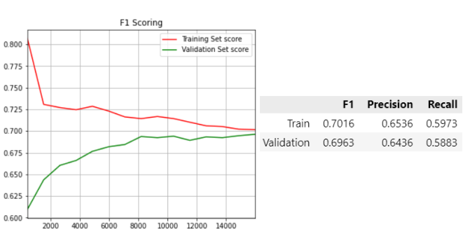

## Artificial Intelligence II Homework 1
### Pavlos Spanoudakis (sdi1800184)

Contents:
- `task.pdf`: Detailed tasks for this project
- `docs/question1.pdf`: Detailed solution for Question 1 (theoretical task)
- `TweetClassifier.ipynb`: Solution for Question 2 (with a specific model version)

The report on Question 2, along with several model performance results, is presented below.

***
## Comments & Model Performance results on Question 2

### Basic Execution flow
1) Reading train set & validation set data from the input files, into `DataFrame`'s. The file paths can be modified on the first notebook cell.

2) Checking if all the samples have the expected format without missing values.

3) Trimming the created `DataFrame`'s, keeping just the required data (tweets & labels).

4) Sample vectorization using one of the available vectorizers in `sklearn.feature_extraction.text`.

    The model performs better when `TfidfVectorizer` is used. With `CountVectorizer`, the results are very similar, with a slight performance reduction.

    For better generalization and based on this [discussion](https://piazza.com/class/kud1bfc0uy62rl?cid=22_f1), the train set samples are first used to create the vectorizer vocabulary, and both data sets are vectorized on it.

    Several vectorizer parameters were used for the vocabulary creation:
    - `min_df = 0.1`: Ignores any words that occur in less than 1% of the given samples.
    - `max_df = 0.85`: Ignores any words that occur in more than 85% of the given samples.
    - `preprocessor = customPreprocessor`: Using the `customPreprocessor` function in the notebook, it removes URL's, `@` mentions and digits from each tweet before it is being processed.
    - `stop_words = "english"`: Ignores english stop words, based on the `sklearn` built-in stop words set.
    - `ngram_range = (1, 3)`: Add each phrase with 1, 2 or 3 words to the vocabulary (with respect to the above parameters).

    Many other `min_df`, `max_df` and `ngram_range` combinations were used, but the ones specified had the best results.

5) Instantiating the classifier with the desireable parameters.

    `LogisticRegression` from `sklearn.linear_model` is used, with `max_iter = 1000` and `mutliclass = "multinomial"`.\
    All the available solvers have been used, but `lbfgs` (default) has the best performance.\
    The default `penalty` parameter is set to `l2`, which adds a L2 penalty term.\
    `penalty = "none"`, with `max_iter = 10000` was also tested:
    The learing curves are visibly "smoother" but the final results are basically the same as with `penalty = "l2"`.

6) Making predictions to create the learning curves.

    - We start by creating different train set sizes, equally increasing the current size each time, and for each size, we take a portion of the train set of that size to train the classifier.
    - We make predictions using the classifier we just trained, on that particular portion of the train set, as well as 100% of the validation set.

7) Calculating the predictions scores.

    For each different training set size used, we calculate the **F1**, **Precision** and **Recall** scores of the predictions made by the classifier on the corresponding training set batch and the validation set, after training with that size.

8) Creating & displaying the learning curve.

    Using the F1 scores (as `y` values) and the training set sizes (as `x` values) we plot the curves for the Train and Validation sets respectively.\
    If desired, we can plot curves for the Precision and Recall scores as well.

9) Displaying final scores.

    We display the F1, Precision & Recall scores for the final predictions, after training the classifier using 100% of the train set.\
    We also display confusion matrixes on both set predictions.

### Different models performace comparison
For all the results below, `solver = "lbfgs"` was used in the Classifier.

- Using **`TfidfVectorizer`**:
    - Using `min_df`, `max_df` & `ngram_range` in the Vectorizer:

    

    

    - Using `min_df`, `max_df` & `ngram_range` in the Vectorizer & `penalty="none"` in the Classifier:

    
    

    - Using `min_df`, `max_df`, `customPreprocessor` & `stop_words` in the Vectorizer:

    
    

    - Using `min_df` & `max_df` in the Vectorizer:

    

    

    - Using `min_df`, `max_df`, `customPreprocessor`, `stop_words` & `ngram_range` in the Vectorizer:

    
    

    - Using `customPreprocessor`, `stop_words` & `ngram_range` in the Vectorizer:

    
    

    - Using `customPreprocessor` & `stop_words` in the Vectorizer:

    

    

- Using **`CountVectorizer`**:
    - Using `min_df`, `max_df` & `ngram_range` in the Vectorizer:

    
    

    - Using `min_df`, `max_df` in the Vectorizer:

    
    

### Takeaways
- We see much better performance on `Neutral` and `Pro-Vaccine` tweets in all models, since a significant amount of train set tweets are labeled as such.\
Apparently, the majority of the `Anti-Vaccine` tweets are falsely predicted as `Pro-Vaccine`, which can be explained: Tweets from both labels are expected to have many common features ("vaccine", "virus" etc.). The number of `Pro-Vaccine` tweets in the train set is significantly greater, which confuses the model to increase these feature weights on the `Pro-Vaccine` class.
We can improve the model performance on `Anti-Vaccine` tweets, by "feeding" it with more of them.
- When we do not specify `min_df` & `max_df` parameters, the model is overfitting, since the number of features is way too large and prevents our model predictions from generalizing.
In these cases, we can see that all the metric scores are better, which means that, hypothetically, if we feed the model with more samples, it will achieve better scores (when the two curves eventually approach each other). Of course, the difference between the two curves is huge, therefore the required amount of extra samples may be extreme.
- We see that preprocessing, as well as using stop words list does not help the model. In fact it causes a slight performance reduction, and also increases the "sense" of possible overfitting, since the curves become almost parallel at the end.
- Simply using `CountVectorizer` causes slight scores reduction, so `TfidfVectorizer` (which is essentially `CountVectorizer` & `TfidfTransformer`) seems to be the right choice.
- The final model that is selected in the notebook uses `TfidfVectorizer`, with custom `min_df`, `max_df` & `ngram_range` parameters and a Classifier with just `max_iter = 1000` and `mutliclass = "multinomial"`parameters.

### Resources & Development
- The chapters 4 & 5 of the given [book](http://web.stanford.edu/~jurafsky/slp3/), along with the `sklearn` documentation were eye-opening.
- [This](https://towardsdatascience.com/logistic-regression-using-python-sklearn-numpy-mnist-handwriting-recognition-matplotlib-a6b31e2b166a) is not a literature resource, but it was the first ML tutorial I ever followed and is pretty straightforward.
- The notebook has been developed in WSL Ubuntu 20.04, using Visual Studio Code & Python 3.8.10.\
It has been tested successfully in Google Colab environment as well.

