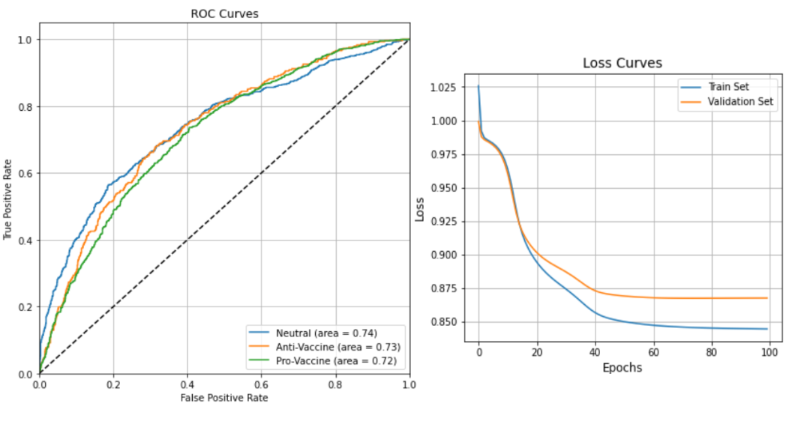

## Artificial Intelligence II Homework 2
## Comments & Model Performance results on Question 3
### Pavlos Spanoudakis (sdi1800184)
***

### Basic Execution flow
1) Reading train set & validation set data from the input files, into `DataFrame`'s. The file paths can be modified on the first notebook cell.

2) Checking if all the samples have the expected format without missing values.

3) Trimming the created `DataFrame`'s, keeping just the required data (tweets & labels).

4) Reading pre-trained word embeddings file, and storing the vector for each given word.

5) Vectorizing the train set & validation set samples using the pre-trained vectors:
    - We start by tokenizing each tweet using `nltk.TweetVectorizer`.
    - For each word/token returned by the tokenizer, we find the corresponding stored vector.
    - We sum up all the vectors and divide the result by the number of tokens in the tweet.\
    This "mean vector" will be assigned to the tweet.\
    If the vector for a word is not found, it does not contribute to the sum, but it does influence the final result, so unknown words essentially "contribute" with a vector of zeros.

6) Creating the Neural Network, selecting Loss function and Optimizer:
    - We create a `Network` instance, with the desired number and size of layers.
    - We create a `TensorDataset` in order create a `DataLoader` which will be used to obtain train set batches during each epoch.
    - We create X and Y Tensors for both sets, which will be used in multiple cases.
    - We select the Loss Function & the Optimizer.

    Hyperparameters such as number of epochs, batch size, learning rate, number & size of layers etc. can be modified on cell #2.

7) Training the model:
    We use `numpy` arrays to store several performance stats during training, such as Loss and F1 score on Train and Validation set after each epoch.\
    During each epoch:
    - For each batch given by the `DataLoader`:
        - We make predictions on this batch
        - Extract the predicted labels & calculate the accuracy
        - Calculate & store the batch Loss
        - Perform backpropagation
    - After going through all the batches, we calculate the total Loss and the F1 score for the Train set
    - We make predictions on the Validation set
    - Calculate & store the Validation set Loss
    - We extract the predicted labels, calculate the accuracy and store the F1 score

8) Displaying performance results:
    After the end of training we display:
    - The Confusion Matrices of the final model predictions on the Train and Validation sets.
    - The F1 Learning Curves for both sets, to demonstrate the performance of the model after each epoch of the training phase.
    - The F1, Precision and Recall scores for the final model on both sets.\
    We use the corresponding **scikit-learn** routines for calculating the scores. We use `average='micro'` for F1 score and `average='macro'` for Precision & Recall scores.
    - Training phase Loss curves for both sets.
    - The ROC Curves for the Validation set predictions.\
    We mirror the usage of `roc_curve` from **scikit-learn** for multiple classes, as demonstrated [here](https://scikit-learn.org/stable/auto_examples/model_selection/plot_roc.html#plot-roc-curves-for-the-multiclass-problem).\
    To create the curves, we apply the `softmax` function to the NN output vector, to convert it to possibility values that add-up to 1, and use the `softmax` output to create the curves.\
    `roc_curve` applies generated possibility thresholds to create the curves, therefore if we provided it with just the predicted labels, it would only apply 3 thresholds to each result, which is insufficient to create useful ROC curves.

### Different models performace comparison
1)  - Optimizer = `SGD`
    - LEARNING_RATE = 0.0045
    - BATCH_SIZE = 64
    - EPOCHS = 175
    - LAYER_SIZES = [128, 32, 8]
    - USE_RELU = True
    - USE_DROPOUT = False
    - EMBEDDINGS_PATH = '/mnt/c/Users/pavlo/Downloads/glove.6B.200d.txt'

    

    

    

2)  - Optimizer = `Adam`
    - LEARNING_RATE = 0.0001
    - BATCH_SIZE = 128
    - EPOCHS = 30
    - LAYER_SIZES = [256, 64, 16]
    - USE_RELU = True
    - USE_DROPOUT = False
    - EMBEDDINGS_PATH = '/mnt/c/Users/pavlo/Downloads/glove.6B.300d.txt'

    

    

    

3)  - Optimizer = `SGD`
    - LEARNING_RATE = 0.004
    - BATCH_SIZE = 32
    - EPOCHS = 100
    - LAYER_SIZES = [64, 32, 16, 8]
    - USE_RELU = False
    - USE_DROPOUT = False
    - EMBEDDINGS_PATH = '/mnt/c/Users/pavlo/Downloads/glove.6B.50d.txt'

    

    

    

### Takeaways
- We see much better performance on `Neutral` and `Pro-Vaccine` tweets in all models, since a significant amount of train set tweets are labeled as such.\
A great percentage of the `Anti-Vaccine` tweets are inevitably predicted as `Pro-Vaccine`: Tweets from both labels are expected to have many common words ("vaccine", "virus" etc.). The number of `Pro-Vaccine` tweets in the train set is significantly greater, which confuses the model to associate them with the `Pro-Vaccine` class.
We can improve the model performance on `Anti-Vaccine` tweets, by "feeding" it with more such data.

### Comparison with HW1 Softmax Regression Model

### Development
The notebook has been developed in WSL Ubuntu 20.04, using Visual Studio Code & Python 3.8.10.\
It has been tested successfully in Google Colab environment as well.
