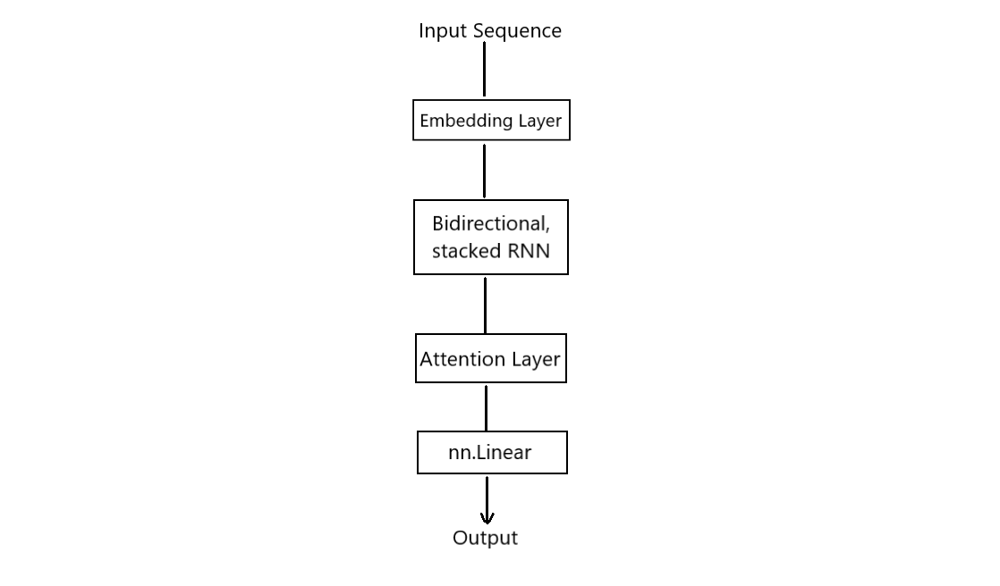
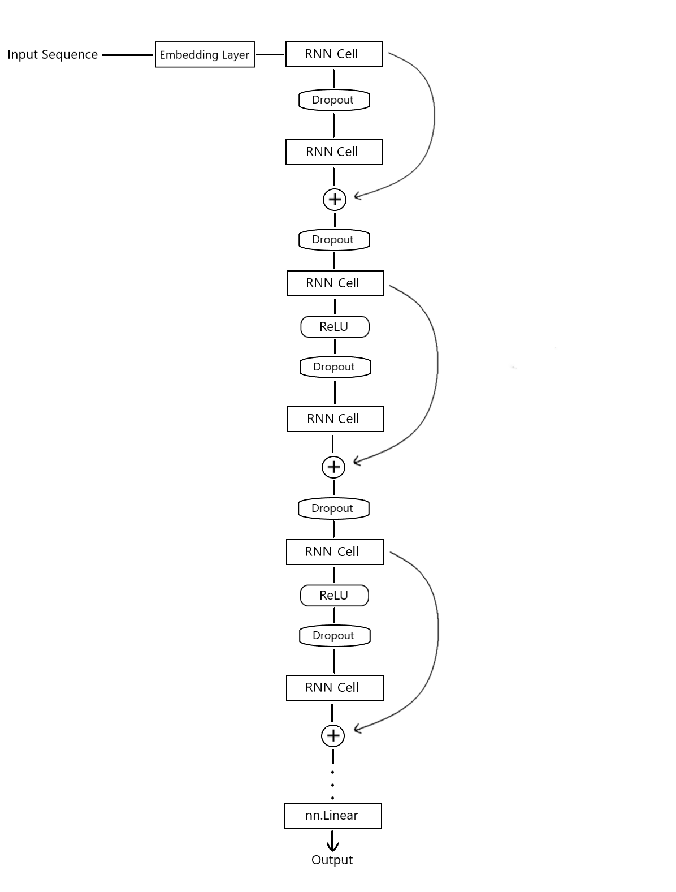

## Artificial Intelligence II Homework 3
## Comments & Model Performance results on Questions 1 & 2
### Pavlos Spanoudakis (sdi1800184)
***

### Basic Execution flow

1) Before creating the train & validation sets, we read the `.csv` files the usual way (with `pd.read_csv`), to check if all the samples have the expected format without missing values, and get the number of samples in the validation set (which will be needed later).

2) We create the Train and Validation sets, using `TabularDataset` objects:
- We preprocess each tweet with `customPreprocessor` and tokenize it using `nltk.TweetVectorizer`.
- We will access the two sets in batches, using `BucketIterator` objects. We initialize the validation set `BucketIterator` with `batch_size` equal to the validation set size, so essentially we access the set in "batch mode" (one batch for the whole set).

3) We create the embeddings matrix, where we store the **GloVe** vector for each word in the train set vocabulary.

4) We initialize the Model. Hyperparameters such as number of epochs, batch size, learning rate, number & size of layers, Dropout probability etc. can be modified on cell #2. \
    We use `CrossEntropyLoss` and the `Adam` optimizer.

5) We train the model:
    We use `numpy` arrays to store several performance stats during training, such as Loss and F1 score on Train and Validation set after each epoch.\
    During each epoch:
    - For each batch given by the train set `BucketIterator`:
        - We make predictions on this batch
        - Extract the predicted labels & calculate the accuracy
        - Calculate & store the batch Loss
        - Perform backpropagation
    - After going through all the batches, we calculate the total Loss and the F1 score for the Train set
    - We make predictions on the Validation set
    - Calculate & store the Validation set Loss
    - We extract the predicted labels, calculate the accuracy and store the F1 score

6) Displaying performance results:
    After the end of training we display:
    - The Confusion Matrices of the final model predictions on the Train and Validation sets.
    - The F1 Learning Curves for both sets, to demonstrate the performance of the model after each epoch of the training phase.
    - The F1, Precision and Recall scores for the final model on both sets.\
    We use the corresponding **scikit-learn** routines for calculating the scores. We use `average='micro'` for F1 score and `average='macro'` for Precision & Recall scores.
    - Training phase Loss curves for both sets.
    - The ROC Curves for the Validation set predictions.\
    We mirror the usage of `roc_curve` from **scikit-learn** for multiple classes, as demonstrated [here](https://scikit-learn.org/stable/auto_examples/model_selection/plot_roc.html#plot-roc-curves-for-the-multiclass-problem).\
    To create the curves, we apply the `softmax` function to the NN output vector, to convert it to possibility values that add-up to 1, and use the `softmax` output to create the curves.\
    `roc_curve` applies generated possibility thresholds to create the curves, therefore if we provided it with just the predicted labels, it would only apply 3 thresholds to each result, which is insufficient to create useful ROC curves.

***
### Model types used during development
-   Models 1, 2 have the following architecture:
     
    (Model 2 does not use attention layer, but other than that the structure is the same.\
    Model 1 is the chosen model, and can be used with or without attention layer. See the next section for the performance comaprison.)

    - We use bidirectional, stacked RNN, without skip connections.
    - If desired (optionally in Model 1), we can pass the RNN output through an Attention Layer, to help the model focus in critical parts of each tweet and prevent the vanishing gradient in faraway hidden states.
    - Finally, we add a Linear layer to output a vector of the desired size.
- Models 3, 4 have the following architecture:
    
    - We use a stacked RNN, this time with skip connections. We apply a skip connection in every 2 layers (layers 1, 3, 5 etc. have a skip connection, and the output of layers 2, 4, 6 etc. is the destination of a skip connection). Skip connections are implemented simply using `torch.add`
    - Before providing input to any layer (except for the first one) we apply a Dropout layer to it.
    - We apply a `ReLU` layer to the odd layer outputs, except for the first one.
    - Finally, we add a Linear layer to output a vector of the desired size.

***
### Different models performace comparison
**Notes** on all models:
- The performance results displayed below have been produced without using GPU acceleration.
- When not using GPU, the results can be reproduced using `SEED = 42`.
- Unfortunately, GPU-accelerated model results could not be fully reproduced.
- The execution of each model using only CPU takes about 4-5 minutes. 
In case this is inconvenient, GPU can be enabled in code cell #6, but note that
 the results for all models will differ from the ones presented bellow.
- All models use the **GloVe** pre-trained word embeddings from `glove.6B.100d.txt`.
1) This is the preselected model in the interactive notebook. For this model, we use:
    - Embeddings File: `glove.6B.200d.txt`
    - Optimizer: `SGD`
    - Learning rate: 0.0045
    - Batch Size: 64
    - \# Epochs: 175
    - Network Layers:
        - Input Layer (in -> `n_features`, out -> 128)
        - Hidden Layer 1 (in -> 128, out -> 32)
        - ReLU
        - Hidden Layer 2 (in -> 32, out -> 8)
        - ReLU
        - Output Layer (in -> 8, out -> `n_classes`)

    

    

    

2) For the next model, we use:
    - Embeddings File: `glove.6B.300d.txt`
    - Optimizer: `Adam`
    - Learning rate: 0.0001
    - Batch Size: 128
    - \# Epochs: 30
    - Network Layers:
        - Input Layer (in -> `n_features`, out -> 256)
        - Hidden Layer 1 (in -> 256, out -> 64)
        - ReLU
        - Hidden Layer 2 (in -> 64, out -> 16)
        - ReLU
        - Output Layer (in -> 16, out -> `n_classes`)

    

    

    

3) For the thrid and final model, we use:
    - Embeddings File: `glove.6B.50d.txt`
    - Optimizer: `SGD`
    - Learning rate: 0.004
    - Batch Size: 32
    - \# Epochs: 100
    - Network Layers:
        - Input Layer (in -> `n_features`, out -> 64)
        - Hidden Layer 1 (in -> 64, out -> 32)
        - Hidden Layer 2 (in -> 32, out -> 16)
        - Hidden Layer 3 (in -> 16, out -> 8)
        - Output Layer (in -> 8, out -> `n_classes`)

    

    

    

### Comments/Observations on each model
- The first model is also the preselected model in the notebook.\
We notice that it "learns" slowly and firmly, since Stochastic Gradient Descent is used.
It is worth mentioning that the addition of ReLU layers made a significant improvement in the model performance. The learning rate and the number of epochs have been tuned, so that the model loss on the validation set is not increased at any point of the training phase, while maintaining similar performance of both sets, avoiding any overfitting.
- The second model is drastically different.\
`Adam` optimizer leads to satisfying performance really quick, with slightly more instability on the Validation set performance, as displayed in the F1 curve.\
The fact that this model is an "early learner" is displayed in the Loss curve as well:\
The loss drops really fast in the early epochs, and then starts dropping significantly more slowly.
-   The third model is a modified version of the first one (and was actually one of the first ones working properly).\
    The differences from the first model are:
    - The word vector dimensions are 50 instead of 200, so the network has fewer information to work with. This leads to worse performance potential, as well as less overfitting.
    - No ReLU activation layers are used and that seemed to not help the model during the tests.
    - The Batch size, the number of epochs, as well as the number and size of layers has been tuned in order to avoid overfitting (the performance on the Validation set was essentially not affected).

    The model performance is visibly worse in all metrics and the loss for both sets is stabilized after a point, which does not indicate satisfying potential.

### Takeaways
- We see much better performance on `Neutral` and `Pro-Vaccine` tweets in all models, since a significant amount of train set tweets are labeled as such.\
A great percentage of the `Anti-Vaccine` tweets are inevitably predicted as `Pro-Vaccine`: Tweets from both labels are expected to have many common words ("vaccine", "virus" etc.). The number of `Pro-Vaccine` tweets in the train set is significantly greater, which confuses the model to associate them with the `Pro-Vaccine` class.
We can improve the model performance on `Anti-Vaccine` tweets, by "feeding" it with more such data.
- Stochastic Gradient Descent leads to slower, but firm learing, while `Adam` encourages fast but more unstable learning.
- The increase in the word vector dimensions can help in learning generalization up to a certain point.
- The ROC curves show that while the model may have trouble classifying `Anti-Vaccine` tweets correctly, the possibility assigned to this class when the prediction is wrong is not small. In other words, the model may be **misclassifying** the `Anti-Vaccine` tweets, but **it is not very "confident"** in these cases.

### Comparison with HW1 Softmax Regression Model
Below are the performance results of the model obtained using SoftMax Regression in HW1:

We can see that the results are not drastically different, probably due to the "naive" use of word vectors in HW2:
Simply taking the mean vector of all words in a tweet does not take important factors into account, such as the position of the words, or meaningful word combinations.\
Despite that fact, we can see that the NN classifier seems less biased by the the class imbalance in the Train set, since it labels less `Neutral` tweets correctly, and more `Pro-Vaccine` tweets correctly. The performance on the `Anti-Vaccine` tweets might be disappointing, since the imbalance is huge, but as mentioned above, the ROC Curve shows that the model is not that confident when mislabeling `Anti-Vaccine` tweets.

### Development
The notebook has been developed in WSL Ubuntu 20.04, using Visual Studio Code & Python 3.8.10.\
It has been tested successfully in Google Colab environment as well.
