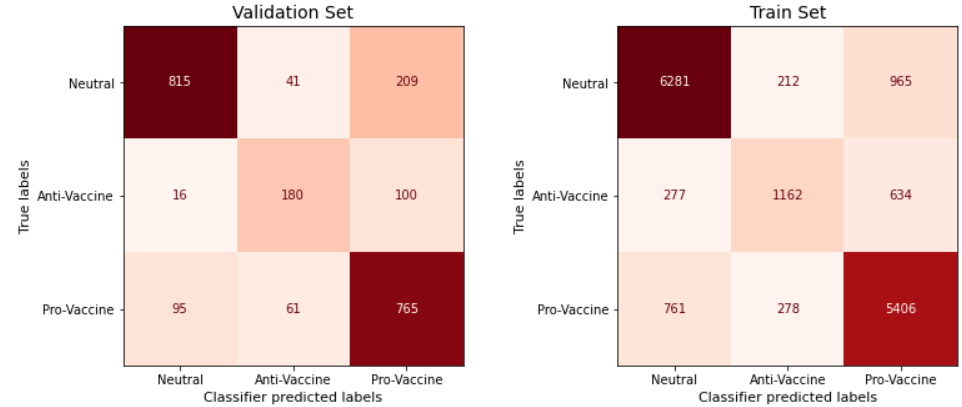
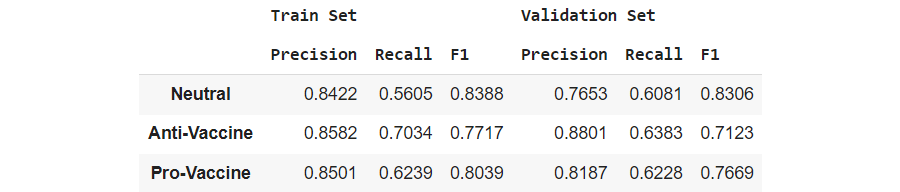
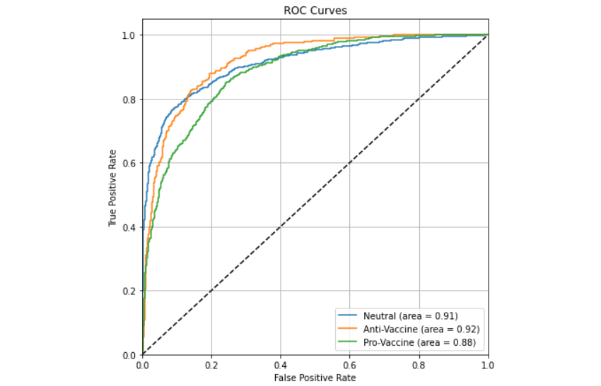
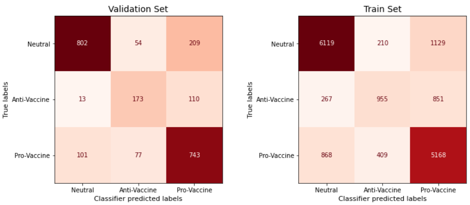
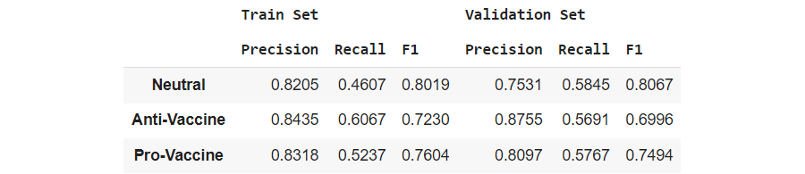
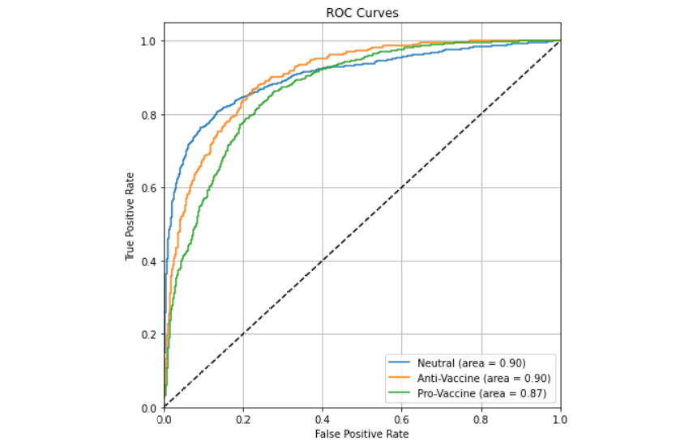
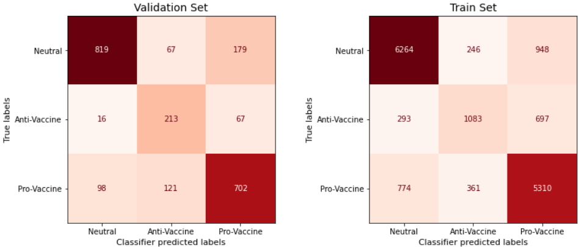
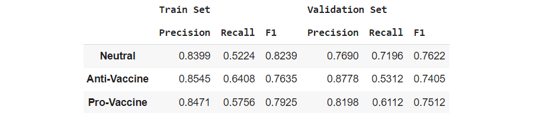
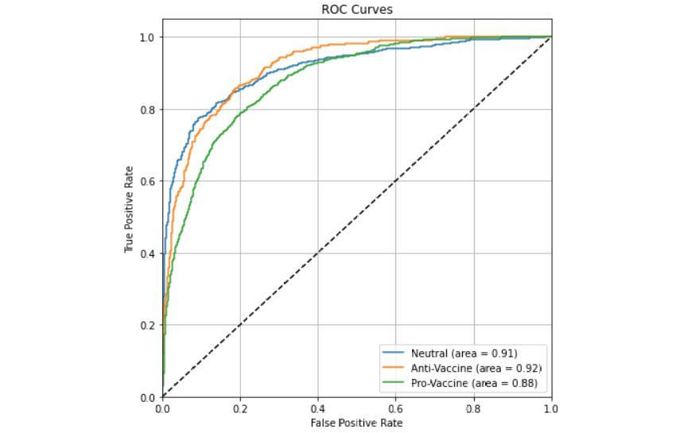
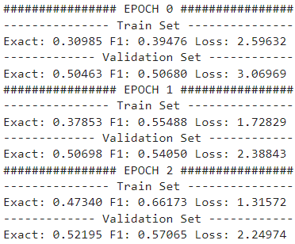

## Artificial Intelligence II Homework 4
### Pavlos Spanoudakis (sdi1800184)

Contents:
- `task.pdf`: Detailed tasks for this project
- `TweetClassifierBERT.ipynb`: Solution for Question 1 (with a specific model version)
- `SQuAD-BERT-Model.ipynb`: Solution for Questions 2

The report on Questions 1 & 2, along with several model performance results, is presented below.

***
## Comments & Model Performance results on Question 1

### Basic Execution flow

1)  We read the train & validation sets data from the input files, into `DataFrame`'s. The file paths can be modified on the notebook code cell #3.
    We also check whether all the samples have the expected format without missing values.

2)  We create the Train and Validation sets, using `TweetDataset` objects. We tokenize each sample using `BertTokenizer`, for the pretrained `bert-base-uncased` model.

3)  We will access the two sets in batches, using `DataLoader` objects.

4)  We initialize the Model. Hyperparameters such as number of epochs, batch size, learning rate & Dropout probability can be modified on code cell #5.
    We use `CrossEntropyLoss` and the `Adam` optimizer.

5)  We train the model:
    We use `list`s to store several performance stats during training, such as Loss and Accuracy on Train and Validation sets after each epoch.\
    During each epoch:
    - For each batch given by the train set `DataLoader`:
        - We make predictions on this batch
        - Extract the predicted labels & calculate the accuracy
        - Calculate & store the batch Loss
        - Perform backpropagation
    - After going through all the batches, we calculate the total accuracy & total Loss for the Train set in the epoch.
    - We perform the same actions on the validation set, this time without performing backpropagation of course.
    - During the final epoch, we store the predicted labels, as well as the model output (on both sets), to use in the final evaluation phase right after.

6)  Displaying performance results. After the end of training we display:
    - The Confusion Matrices of the final model predictions on the Train and Validation sets.
    - The F1, Precision and Recall scores on each class, for the final model (on both sets).\
    We use `precision_recall_fscore_support` routine from **scikit-learn** to calculate the scores.
    - The ROC Curves for the Validation set predictions.\
    We mirror the usage of `roc_curve` from **scikit-learn** for multiple classes, as demonstrated [here](https://scikit-learn.org/stable/auto_examples/model_selection/plot_roc.html#plot-roc-curves-for-the-multiclass-problem).\
    To create the curves, we apply the `softmax` function to the NN output vector, to convert it to possibility values that add-up to 1, and use the `softmax` output to create the curves.\
    `roc_curve` applies generated possibility thresholds to create the curves, therefore if we provided it with just the predicted labels, it would only apply 3 thresholds to each result, which is insufficient to create useful ROC curves.

### Model Architecture
The model has a simple architecture. It is implemented in the `BertTweetClassifier` class:
- We start with the `bert-base-uncased` pretrained model, getting the `CLS` size 768 output.
- We apply a dropout layer on the BERT output.
- We then apply a `Linear` layer to produce a size 3 output.
- Finally, we apply a `ReLU` layer and return the result.

### Different models performance comparison
**Notes** on all models:
- The performance results displayed below have been produced using `SEED = 256` for random generators.
- Unfortunately, GPU-accelerated model results could not be fully reproduced with certainty.
- We use `MAX_LENGTH = 100` in all models.
1) This is the preselected model in the interactive notebook. For this model, we use:
    - Learning rate: 3e-5
    - Batch Size: 64
    - \# Epochs: 2
    - Dropout probability: 0.2
    - Execution Time: ~20 minutes

    

    

    
2) In this model, we use:
    - Learning rate: 5e-6
    - Batch Size: 32
    - \# Epochs: 3
    - Dropout probability: 0.25
    - Execution Time: ~15 minutes
    

    

    
3) In this model, we use:
    - Learning rate: 1e-5
    - Batch Size: 16
    - \# Epochs: 2
    - Dropout probability: 0.1
    - Execution Time: ~20 minutes
    

    

    

### Comments/Observations on the models and their develpoment
- Model hyperparameters are mostly based on/influenced by the BERT authors recommendations:
    - Batch Sizes: 8, 16, 32, 64, 128 \
    Training with Batch Size = 8 caused overfitting in most cases. Training with Batch Size = 128 caused `CUDA: out of memory` errors in Google Colab.
    - Learning Rates: 3e-4, 1e-4, 5e-5, 3e-5 \
    The Learning Rates of the presented models are a result of fine-tuning, tweaking and experimenting with the recommended ones.
    - Number of Epochs: 4 \
    In our case, the experiments showed that 2-3 epochs are more suitable.
- MAX_LENGTH = 100 appeared to be enough for decent results, without increasing the execution time dramatically.
- In comparison with the previous projects models, we notice that BERT model can achieve decent performance even with huge class imbalance regarding "Anti-Vaccine" tweets.
- The performance across all classes is improved, as we can notice in the ROC Curves, where the ROC area for each class in increased from the previous models.

### Development
-   The notebook has been developed in Google Colab and was based on the Projects 2 & 3 notebooks.
-   It has been tested successfully in Google Colab & Kaggle environments, using GPU-accelerated runtimes.
    - **Note**: In Kaggle, Confusion Matrices code crashes because `ConfusionMatrixDisplay.from_predictions` appears to be unavailable.

***
## Comments & Notes on Question 2 Model

### Basic Execution flow

1)  We read both SQuAD 2.0 datasets and store them in `QuestionsDataset` objects.
    - For each Context, we store:
        - The original text
        - The token ids returned by the tokenizer for this text. \
        To map each question `answer_start` (and the last character index) to a token index, we store:
            - The corresponding tokens for the returned ids
            - The whitespace character positions in the original text.
    - For each Question we store:
        - The original text
        - A reference to the corresponding Context object
        - A `tuple` where we store the beginning and ending token indexes of the answer. To find the 2 indexes, we iterate over the Context tokens and their characters, while taking into account the number of whitespaces characters in the original Context text, to locate the target tokens and their indexes.

2) We initialize a `DataLoader` object for each dataset, to use during training. In each batch, it will return:
    - Questions texts
    - Contexts texts
    - Questions answers

3) We initialize the Model. We use the `BertForQuestionAnswering` class, based on the pretrained `bert-base-uncased` model & the `Adam` optimizer.

3)  We train the Model:
    We use `list`s to store several performance stats during each epoch, such as Loss and Accuracy on Train and Dev sets, and print the total stats across all batches after the end of the epoch. \
    During each epoch:
    - For each batch given by the train set `DataLoader`:
        - We make predictions on this batch
        - Extract the predicted answers
        - Calculate and store the exact score and F1 score
        - Store the batch Loss
        - Perform backpropagation
    - After going through all the batches, we calculate the total exact score, F1 score and Loss for the Train set in the current epoch.
    - We perform the same actions on the Dev set, this time without performing backpropagation of course.
    - We display the total epoch stats for both sets.

### Model Parameters & Performance
- When initially tokenizing the Contexts, to find the Question answers, we tokenize them using `MAX_LENGTH=350`. During the training, we tokenize each Question + Context pair using `MAX_LENGTH=400`, but also using `truncation_strategy=ONLY_SECOND`, to avoid losing Questions information.
- Learning Rate is set to 5e-5.
- We train for 3 Epochs.
- We use Batch Size 16.
- The execution takes ~ 110 minutes per epoch (5h 30min in total), if both sets are used 100%. There is also the option of limiting the number of samples to read from each set, by providing a `limit` parameter to `readDataset`.
- Below are the stats displayed during training: \
    

### Comments on the Model & its development
- This Question 2 solution is certainly far from complete.
- Training with Batch Size > 16 was not possible (`CUDA: out of memory` errors) without reducing the `MAX_LENGTH` furthermore, which would lead to truncating an important amount of contexts and questions.
- The notebook is influenced by Chris McCormick's notebook presented in courses.

### Development
The notebook has been developed in Kaggle, due to the restrictions regarding GPU usage, as well as worse speed performance in Google Colab.
