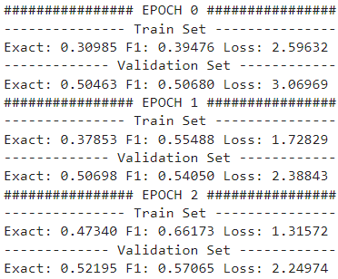

## Artificial Intelligence II Homework 4
## Comments & Notes on Question 2 Model
### Pavlos Spanoudakis (sdi1800184)
***

### Basic Execution flow

1)  We read both SQuAD 2.0 datasets and store them in `QuestionsDataset` objects.
    - For each Context, we store:
        - The original text
        - The token ids returned by the tokenizer for this text. \
        To map each question `answer_start` (and the last character index) to a token index, we store:
            - The corresponding tokens for the returned ids
            - The whitespace character positions in the original text.
    - For each Question we store:
        - The original text
        - A reference to the corresponding Context object
        - A `tuple` where we store the beginning and ending token indexes of the answer. To find the 2 indexes, we iterate over the Context tokens and their characters, while taking into account the number of whitespaces characters in the original Context text, to locate the target tokens and their indexes.

2) We initialize a `DataLoader` object for each dataset, to use during training. In each batch, it will return:
    - Questions texts
    - Contexts texts
    - Questions answers

3) We initialize the Model. We use the `BertForQuestionAnswering` class, based on the pretrained `bert-base-uncased` model & the `Adam` optimizer.

3)  We train the Model:
    We use `list`s to store several performance stats during each epoch, such as Loss and Accuracy on Train and Dev sets, and print the total stats across all batches after the end of the epoch. \
    During each epoch:
    - For each batch given by the train set `DataLoader`:
        - We make predictions on this batch
        - Extract the predicted answers
        - Calculate and store the exact score and F1 score
        - Store the batch Loss
        - Perform backpropagation
    - After going through all the batches, we calculate the total exact score, F1 score and Loss for the Train set in the current epoch.
    - We perform the same actions on the Dev set, this time without performing backpropagation of course.
    - We display the total epoch stats for both sets.

***
### Model Parameters & Performance
- When initially tokenizing the Contexts, to find the Question answers, we tokenize them using `MAX_LENGTH=350`. During the training, we tokenize each Question + Context pair using `MAX_LENGTH=400`, but also using `truncation_strategy=ONLY_SECOND`, to avoid losing Questions information.
- Learning Rate is set to 5e-5.
- We train for 3 Epochs.
- We use Batch Size 16.
- The execution takes ~ 110 minutes per epoch (5h 30min in total), if both sets are used 100%. There is also the option of limiting the number of samples to read from each set, by providing a `limit` parameter to `readDataset`.
- Below are the stats displayed during training: \
    
***
### Comments on the Model & its development
- This Question 2 solution is certainly far from complete.
- Training with Batch Size > 16 was not possible (`CUDA: out of memory` errors) without reducing the `MAX_LENGTH` furthermore, which would lead to truncating an important amount of contexts and questions.
- The notebook is influenced by Chris McCormick's notebook presented in courses.

***
### Development
The notebook has been developed in Kaggle, due to the restrictions regarding GPU usage, as well as the worse GPU performance in Google Colab.
